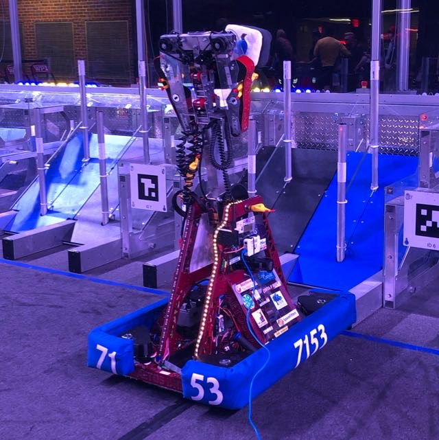

# Charged Up

*"Crimson Crusher"* 
FRC 7153, Aetos Dios  
Charged Up, 2023 Season

## Overview
- SDS Mk4i L3 Swerve Modules, field-oriented drive
- 2-DOF arm (extend and rotate)
- Gyro for front orientation detection
- Alliance-colored LED strip
- RaspberryPi + 2 Limelights

## Controls
* **Xbox Controller 0:**
    * **Left Joystick:** Drive base strafe
    * **Right Joystick:** Drive base rotation
    * **Right Trigger:** toggle claw open/close
* **Logitech Joystick 1:**
    * **Joystick Y Axis:** Manual arm angle control
    * **Throttle:** Manual arm extension control
    * **Trigger:** Arm to preset loading station position 
    * **Button 3:** LEDs to yellow color
    * **Button 4:** LEDs to purple color
    * **Button 7:** Arm to preset *cone high* position
    * **Button 8:** Arm to preset *cube high* position
    * **Button 9:** Arm to preset *cone mid* position
    * **Button 10:** Arm to preset *cube mid* position
    * **Button 11:** Arm to preset *front ground* position
    * **Button 12:** Arm to preset *rear ground* position

## Competitions
- Western NE
- Worcester Polytechnic Institute
- New England District Champs (MEIR division)
- World Champs (Daly division)
- Where is Wolcott? Invitational (offseason)
- CIAC Connecticut State Champs (offseason)
- Bash at the Beach (offseason)

View Hardware IDs

### CAN IDs
0. RoboRio
1. Main Power Distribution Hub (REV PDH)
2. *(unassigned)*
3. Rear Left Swerve Drive Motor (Falcon500/TalonFX)
4. Rear Right Swerve Drive Motor (Falcon500/TalonFX)
5. Front Left Swerve Drive Motor (Falcon500/TalonFX)
6. Front Right Swerve Drive Motor (Falcon500/TalonFX)
7. Rear Left Swerve Steer Motor (NEO/CAN Spark Max)
8. Rear Right Swerve Steer Motor (NEO/CAN Spark Max)
9. Front Left Swerve Steer Motor (NEO/CAN Spark Max)
10. Front Right Swerve Steer Motor (NEO/CAN Spark Max)
11. Rear Left Swerve Encoder (CTRE CANCoder)
12. Rear Right Swerve Encoder (CTRE CANCoder)
13. Front Left Swerve Encoder (CTRE CANCoder)
14. Front Right Swerve Encoder (CTRE CANCoder)
15. Arm Winch Motor (NEO/CAN Spark Max)
16. Arm Angle Motor (NEO/CAN Spark Max)
17. Claw Right Motor (NEO 550/CAN Spark Max)
18. Claw Left Motor (NEO 550/CAN Spark Max)
19. ~~Arm Vision Processor (RaspberryPi 4b)~~
20. ~~Jouster Neo (NEO 550/CAN Spark Max)~~

### RoboRIO Header Pins
- **PWM Port 0:** LEDs (Rev Blinkin)
- **DIO Channel 8:** Arm Angle Encoder (Rev Through-Bore Encoder)

